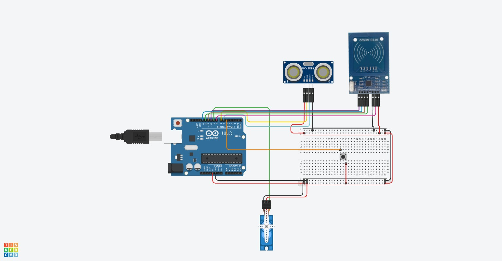

# Proyecto: Puerta de Garaje Automática con RFID, Sensor Ultrasónico y Cierre Forzado

# Índice

1. [Descripción General](#descripción-general)
2. [Componentes Utilizados y Explicación Técnica](#componentes-utilizados-y-explicación-técnica)
3. [Conectividad entre Componentes](#diagrama-de-conexiones)
4. [Código Completo y Explicación Técnica](#código-completo-y-explicación-técnica)
   - [Librerías necesarias](#librerías-necesarias)
   - [Definición de pines y variables](#definición-de-pines-y-variables)
   - [Setup - Configuración inicial](#setup---configuración-inicial)
   - [Loop - Lógica principal](#loop---lógica-principal)
5. [Explicación de Métodos](#explicación-de-métodos)
   - [Método tarjetaValida()](#método-tarjetavalida)
   - [Método abrirPuerta()](#método-abrirpuerta)
   - [Método cerrarPuerta()](#método-cerrarpuerta)
   - [Método obstaculoDetectado()](#método-obstaculodetectado)
   - [Método botonForzado()](#método-botonforzado)
6. [Webgrafía](#webgrafía)
---

## Descripción General
El objetivo de este proyecto es la automatización de una puerta de garaje, se automatiza utilizando diversos componentes electrónicos. Los elementos clave del sistema son los siguientes:

- **Lector RFID**: Este dispositivo es el encargado de autorizar la apertura de la puerta. Cuando se detecta una tarjeta o dispositivo RFID autorizado, el sistema activa el mecanismo de apertura de la puerta.

- **Servomotor**: El servomotor es el componente que abre y cierra con precisión la puerta de garaje. Una vez que el lector RFID ha autorizado el acceso, el servomotor se activa para abrir la puerta. Al completar su acción, el servomotor se encarga de cerrar la puerta cuando se requiere.

- **Sensor Ultrasónico**: El sensor ultrasónico detecta obstáculos en el camino de la puerta mientras está abierta. Si se detecta un obstáculo, el sistema reinicia el contador de tiempo, permitiendo que la puerta se mantenga abierta hasta que el obstáculo haya desaparecido.

- **Botón Físico**: Este botón permite realizar un cierre forzado de la puerta. Si se mantiene presionado durante 2 segundos, el sistema cierra la puerta ignorando cualquier obstáculo en el camino, garantizando el cierre aunque haya un objeto detectado.
---

## Componentes Utilizados y Explicación Técnica

| Componente                 | Descripción                                                   |
|----------------------------|---------------------------------------------------------------|
| Arduino UNO                | Microcontrolador central del sistema                          |
| Módulo RFID RC522          | Lector de tarjetas RFID                                       |
| Sensor Ultrasónico HC-SR04 | Medición de distancias y detección de obstáculos              |
| Servomotor SG90            | Accionamiento de la puerta                                    |
| Botón                      | Activa el cierre forzado                                      |
| Protoboard y cables        | Conexiones                                                    |
| Fuente de alimentación     | Alimentación externa si es necesario por el consumo del servo |

### Arduino UNO
- Entradas y salidas digitales y analógicas.
- Comunicación con RFID, sensor ultrasónico y servo.

### Módulo RFID RC522
- Lector de tarjetas por radiofrecuencia (13.56 MHz).
- Comunicación por bus SPI.
- Componentes: Antena, chip lector, conexión SPI.

### Sensor Ultrasónico HC-SR04
- Mide distancias utilizando ultrasonido mediante los pines Trig y Echo.
  - **Trig**: Envía una señal ultrasónica.
  - **Echo:** Recibe el rebote de la señal y calcula el tiempo que ha tardado en volver.
- **Fórmula de distancia:**
- `Distancia (cm) = (Tiempo_Echo * 0.034) / 2`
  - Se divide entre **2** porque el sonido viaja hasta el objeto y luego regresa.

El sensor ultrasónico se utiliza para detectar obstáculos mientras la puerta está abierta, reiniciando el contador de tiempo si detecta un objeto.


### Servomotor SG90
- Accionamiento de la puerta utilizando señales **PWM** (Pulse Width Modulation).
- Rango de movimiento: **0°** (cerrado) a **90°** (abierto).
- Permite abrir y cerrar la puerta de garaje con precisión y control.
### Botón de Cierre Forzado
- Sensor digital con resistencia Pull-Up interna.
- Permite forzar el cierre de la puerta.

## Diagrama de Conexiones


## Conectividad entre Componentes

| Componente               | Pin Arduino|
|--------------------------|------------|
| RFID SDA                 | 10         |
| RFID SCK                 | 13         |
| RFID MOSI                | 11         |
| RFID MISO                | 12         |
| RFID RST                 | 8          |
| Servo (señal)            | 9          |
| HC-SR04 TRIG             | 7          |
| HC-SR04 ECHO             | 6          |
| Botón de cierre forzado  | 5          |

---

## Código Completo y Explicación Técnica

### Librerías necesarias
```Arduino
#include <SPI.h>
#include <MFRC522.h>
#include <Servo.h>
```
Las librerias utilizadas son:
* `SPi.h`: comunicación con el RFID por SPI.
* `MFRC522.h`: gestión de lectura RFID.
* `Servo.h`: control del servomotor.

### Definición de pines y variables
```Arduino
#include <Servo.h>
#include <SPI.h>
#include <MFRC522.h>

const int RST_PIN=8;
const int SS_PIN=10;
const int SERVO_PIN=9;
const int TRIG_PIN=7;
const int ECHO_PIN=6;
const int BOTON_PIN=5;
const int TIEMPO_ABIERTO=10000; // 10 segundos
const int DISTANCIA_MINIMA=10; // Distancia mínima para detectar un obstáculo (cm)

MFRC522 rfid(SS_PIN, RST_PIN);
Servo servo;
bool puertaAbierta=false;
unsigned long tiempoInicio=0;

// UID de la tarjeta autorizada (modifícalo con tu tarjeta)
byte tarjetaAutorizada[] = {0x12, 0x34, 0x56, 0x78};
```
* Se definen los pines de conexión de cada componente con el Arduino.

* `TIEMPO_ABIERTO`: Indica cuánto tiempo la puerta permanecerá abierta (10 segundos).

* `puertaAbierta`: Variable que indica si la puerta está abierta o no.

* `tiempoInicio`: Guarda el tiempo en el que la puerta se abrió.

### Setup - Configuración inicial
Se ejecuta **una sola vez** al encender el Arduino o al reiniciarlo. Se usa para configurar los pines, inicializar variables y librerías, y preparar los componentes.

```Arduino
void setup() {
  Serial.begin(9600);
  SPI.begin();
  rfid.PCD_Init();
  servo.attach(SERVO_PIN);
  pinMode(TRIG_PIN, OUTPUT);
  pinMode(ECHO_PIN, INPUT);
  pinMode(BOTON_PIN, INPUT_PULLUP);
  servo.write(0);  // Puerta cerrada al iniciar
}
```
##### Explicación del código
1. `Serial.begin(9600);`:
    - Habilita la comunicación serie con la computadora a 9600 baudios.
    - Se usa para depuración (`Serial.print()`).
2. `SPI.begin();`:
    - Inicia la comunicación SPI, que es necesaria para que Arduino hable con el lector RFID.
3. `rfid.PCD_Init();`:
    - Inicializa el módulo RFID RC522.
4. `servo.attach(SERVO_PIN);`:
    - Conecta el servomotor al pin especificado para poder controlarlo.
5. `Configuración de pines:`:
    - `pinMode(TRIG_PIN, OUTPUT);` → El pin TRIG del sensor ultrasónico se usa para enviar un pulso.
    - `pinMode(ECHO_PIN, INPUT);` → El pin ECHO recibe el eco del sensor.
    -`pinMode(BOTON_PIN, INPUT_PULLUP);` → Se configura el botón con resistencia pull-up interna, es decir, estará en `HIGH` hasta que se pulse.
6. `servo.write(0);`:
    - Mueve el servomotor a la posición de puerta cerrada.

### Loop - Lógica principal

Se ejecuta **continuamente** en un bucle infinito. Es donde se coloca la lógica del programa, las lecturas de sensores, y las acciones a realizar.

``` Arduino
void loop() {
  if (tarjetaValida()) abrirPuerta();

  if (puertaAbierta) {
    if (obstaculoDetectado()) tiempoInicio = millis();

    if (botonForzado()) {
        cerrarPuerta();
        return;
    }

    if (millis() - tiempoInicio >= TIEMPO_ABIERTO) {
        if (!obstaculoDetectado()) cerrarPuerta();
        else tiempoInicio = millis();
    }
  }
}

```
##### Explicación del código

1. **Comprueba si hay una tarjeta RFID válida:**
```Arduino
if (tarjetaValida()) abrirPuerta();
```
- Si se detecta una tarjeta RFID, se llama a `abrirPuerta()` **para abrir la puerta.**
  - En cado que la tarjeta no sea válida, el programa **no hará nada**

2. **Si la puerta está abierta...**
    ```Arduino
    if (puertaAbierta) {
    ```
    - Si la variable `puertaAbierta` es `true`, entonces:
        - **Verifica si hay obstáculos con el sensor ultrasónico**
        ``` Arduino
        if (obstaculoDetectado()) tiempoInicio = millis();
        ```
        - Si detecta un objeto, reinicia el temporizador `(tiempoInicio = millis();)`.
    - **Verifica si el botón de cierre forzado está presionado**
    ```Arduino
    if (botonForzado()) {
     cerrarPuerta();
    return;
    }
    ```
    - Si el botón se mantiene pulsado **más de 2 segundos**, cierra la puerta inmediatamente. 
    
- **Verifica si han pasado 10 segundos y no hay obstáculos**
```Arduino
if (millis() - tiempoInicio >= TIEMPO_ABIERTO) {
  if (!obstaculoDetectado()) cerrarPuerta();
  else tiempoInicio = millis();
}
```
  - Si han pasado 10 segundos y **no hay obstáculos**, cierra la puerta.
  - Si hay un obstáculo, reinicia el temporizador `(tiempoInicio = millis();)` y sigue esperando.
# Explicación de Métodos

---

### **Método `tarjetaValida()`**
```Arduino
bool tarjetaValida() {
    if (rfid.PICC_IsNewCardPresent() && rfid.PICC_ReadCardSerial()) {
        Serial.print("UID detectado: ");
        for (byte i = 0; i < rfid.uid.size; i++) {
            Serial.print(rfid.uid.uidByte[i], HEX);
            Serial.print(" ");
        }
        Serial.println();

        // Compara el UID leído con el autorizado
        for (byte i = 0; i < 4; i++) {
            if (rfid.uid.uidByte[i] != tarjetaAutorizada[i]) {
                return false; // No es la tarjeta correcta
            }
        }
        return true; // Tarjeta válida
    }
    return false;
}
```
* `rfid.PICC_IsNewCardPresent()`
  - Verifica si hay una **nueva tarjeta** cerca del lector. Si la tarjeta está presente, devuelve `true`.
* `rfid.PICC_ReadCardSerial()`
  - Lee el número **serial** de la tarjeta. Si la tarjeta es legible, devuelve `true`.
* `Serial.println("Tarjeta detectada");`
  - Imprime un **mensaje** en el monitor serie indicando que una tarjeta fue detectada.
* `return true;`
  - Si la tarjeta es válida, devuelve `true`.
* `return false;`
  - Si no se detecta una tarjeta o no es legible, devuelve `false`.


### **Método `abrirPuerta()`**
```Arduino
void abrirPuerta() {
    servo.write(90);  
    puertaAbierta = true;
    tiempoInicio = millis(); // Inicia el temporizador
    Serial.println("Puerta abierta");
}
```
* `servo.write(90);`
  - Mueve el servomotor a la posición de **90 grados**, lo que abre la puerta.
* `puertaAbierta = true;`
  - Marca la variable `puertaAbierta` como `true`, indicando que la **puerta está abierta**.
* `Serial.println("Puerta abierta");`
  - Imprime un **mensaje** en el monitor serie indicando que la puerta se ha abierto.


### **Método `cerrarPuerta()`**
```Arduino
void cerrarPuerta() {
    servo.write(0);  
    puertaAbierta = false;
    Serial.println("Puerta cerrada");
}
```
* `servo.write(0);`
  - Mueve el servomotor a la posición de **0 grados**, lo que cierra la puerta.
* `puertaAbierta = false;`
  - Marca la variable `puertaAbierta` como `false`, indicando que la **puerta está cerrada**.
* `Serial.println("Puerta cerrada");`
  - Imprime un **mensaje** en el monitor serie indicando que la puerta se ha cerrado.


### **Método `obstaculoDetectado()`**
```Arduino
bool obstaculoDetectado() {
    digitalWrite(TRIG_PIN, LOW);
    delayMicroseconds(2);
    digitalWrite(TRIG_PIN, HIGH);
    delayMicroseconds(10);
    digitalWrite(TRIG_PIN, LOW);

    long duracion = pulseIn(ECHO_PIN, HIGH);
    int distancia = duracion * 0.034 / 2;

    Serial.print("Distancia: ");
    Serial.print(distancia);
    Serial.println(" cm");

    return distancia < DISTANCIA_MINIMA;
}

```
* `digitalWrite(TRIG_PIN, LOW);`
  - Configura el pin TRIG a bajo para iniciar la medición de distancia.
* `delayMicroseconds(2);`
  - Pausa de **2 microsegundos** antes de generar el pulso.
* `digitalWrite(TRIG_PIN, HIGH);`
  - Configura el pin TRIG a alto para enviar el pulso ultrasónico.
* `delayMicroseconds(10);`
  - Pausa de **10 microsegundos** para permitir que el pulso se propague.
* `digitalWrite(TRIG_PIN, LOW);`
  - Vuelve a poner el pin TRIG a bajo para terminar el pulso.
* `duracion = pulseIn(ECHO_PIN, HIGH);`
  - Mide el **tiempo** que tarda el pulso de sonido en regresar al sensor.
* `distancia = duracion * 0.034 / 2;`
  - Calcula la **distancia** al obstáculo utilizando la velocidad del sonido.
* `if (distancia < DISTANCIA_MINIMA)`
  - Si la distancia detectada es menor que el umbral mínimo de distancia (`DISTANCIA_MINIMA`), se detecta un obstáculo.
* `return true;`
  - Devuelve `true` si se detecta un obstáculo.
* `return false;`
  - Si no se detecta un obstáculo, devuelve `false`.


### **Método `botonForzado()`**
```Arduino
bool botonForzado() {
    static unsigned long tiempoPresionado = 0;

    if (digitalRead(BOTON_PIN) == LOW) {
        if (tiempoPresionado == 0) {
            tiempoPresionado = millis(); // Empieza a contar el tiempo
        }
        if (millis() - tiempoPresionado >= 2000) { // Si se mantiene 2 seg
            Serial.println("Cierre forzado activado");
            return true;
        }
    } else {
        tiempoPresionado = 0; // Reiniciar contador cuando se suelta
    }

    return false;
}
```
* `static unsigned long tiempoUltimoBoton = 0;`
  - Se declara una **variable estática** que recuerda el tiempo de la última vez que se presionó el botón.
* `if (digitalRead(BOTON_PIN) == LOW)`
  - Verifica si el **botón** está presionado (en este caso, el botón está configurado para estar en `LOW` cuando se presiona).
* `if (millis() - tiempoUltimoBoton >= 2000)`
  - Si han pasado **más de 2 segundos** desde la última vez que se presionó el botón, se ejecuta el código siguiente.
* `tiempoUltimoBoton = millis();`
  - Actualiza el **tiempo** de la última vez que se presionó el botón.
* `return true;`
  - Si el botón se ha presionado durante **2 segundos**, devuelve `true`.
* `return false;`
  - Si no se ha presionado durante **2 segundos**, devuelve `false`.

---
# Webgrafía
* Documentación oficial de Arduino
https://www.arduino.cc/

* Módulo rfid
https://naylampmechatronics.com/blog/22_tutorial-modulo-lector-rfid-rc522.html

* HC-SR04 Sensor Ultrasónido
https://naylampmechatronics.com/blog/10_tutorial-de-arduino-y-sensor-ultrasonico-hc-sr04.html

* Servo Motor Controlado con Arduino
https://naylampmechatronics.com/blog/33_tutorial-uso-de-servomotores-con-arduino.html

* Projectos de Arduino para principiantes
https://mastermind.ac/curso/fundamentos-de-arduino-de-la-teoria-a-la-practica
